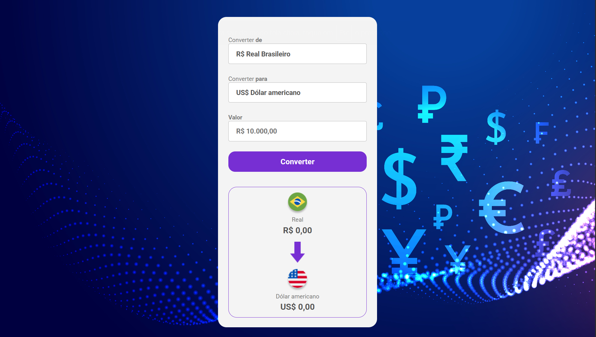

# DevClub Convert Money

Um conversor de moedas simples e eficiente, criado como parte do curso DevClub.



## 🚀 Funcionalidades

- Converte Real Brasileiro (BRL) para Dólar Americano (USD), Euro (EUR), Libra (GBP) e Bitcoin (BTC).
- Utiliza uma API para obter as taxas de câmbio mais recentes.
- Interface limpa e fácil de usar.

## 🛠️ Tecnologias Utilizadas

- **HTML5:** Estrutura da página.
- **CSS3:** Estilização e design.
- **JavaScript:** Lógica da aplicação e comunicação com a API.

## ✨ Como Usar

1. Clone este repositório:
   ```sh
   git clone https://github.com/flaviocalaca/devclub-convert-money.git
   ```
2. Abra o arquivo `index.html` em seu navegador de preferência.

Pronto! Agora você pode usar o conversor.

## 📄 Licença

Este projeto está sob a licença MIT. Veja o arquivo [LICENSE](LICENSE) para mais detalhes.
